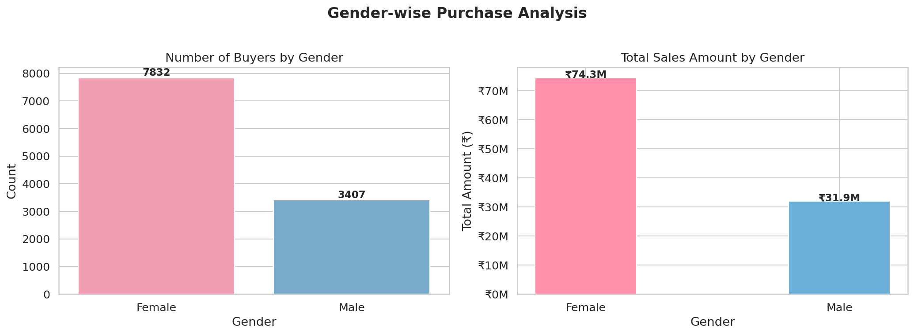
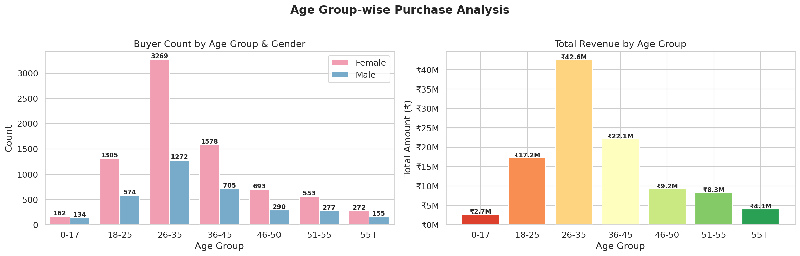
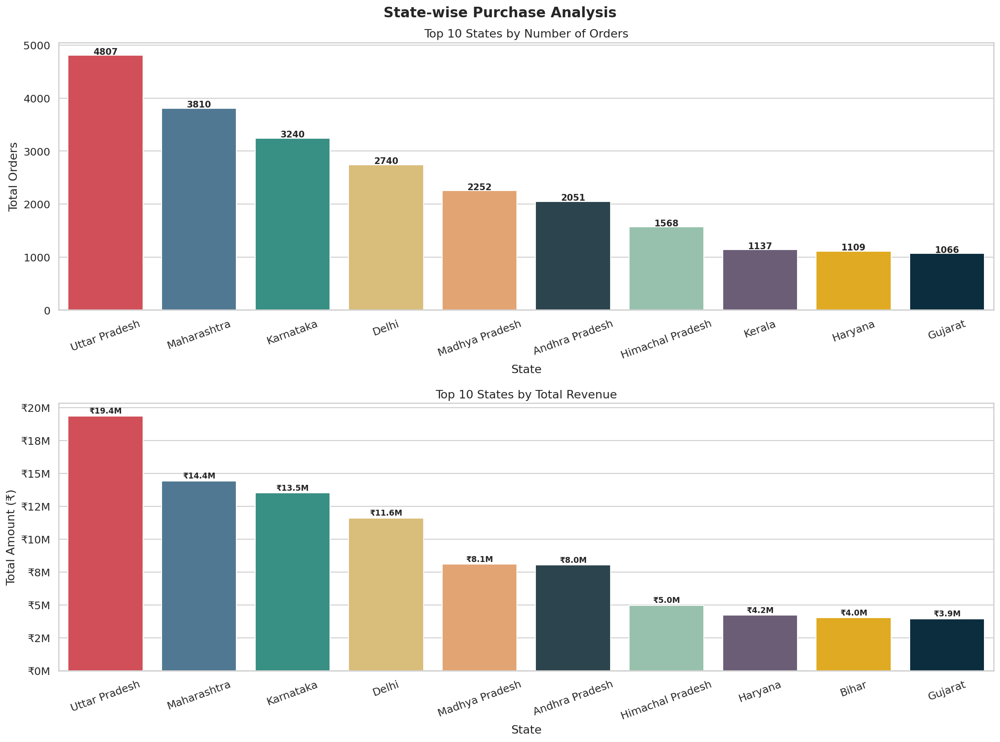
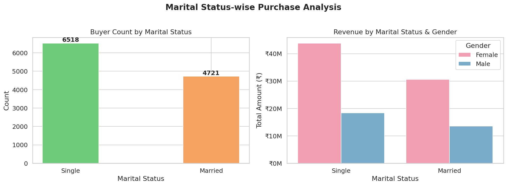
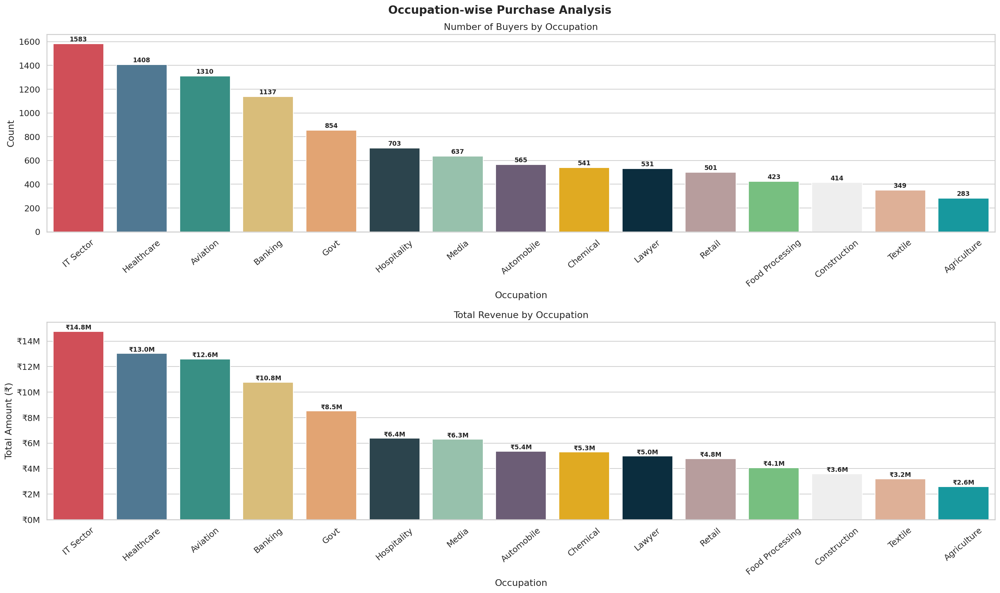
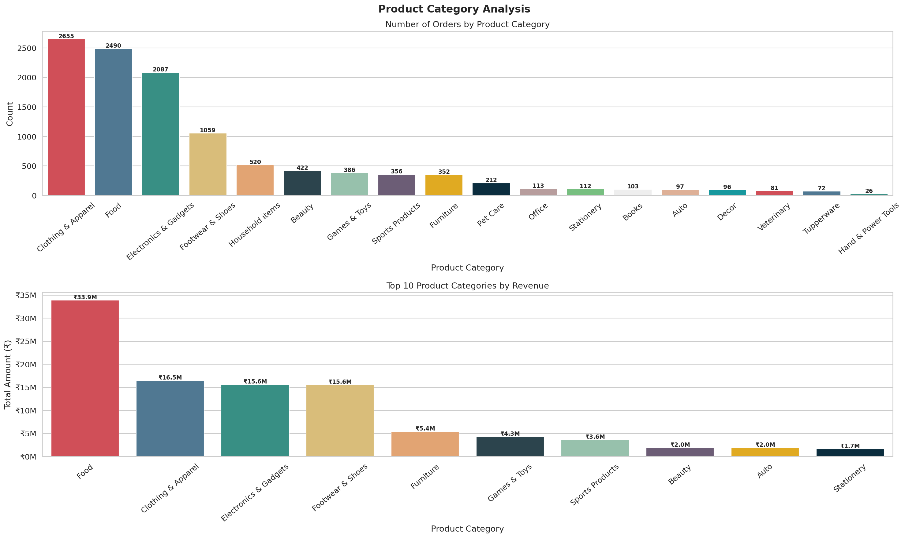
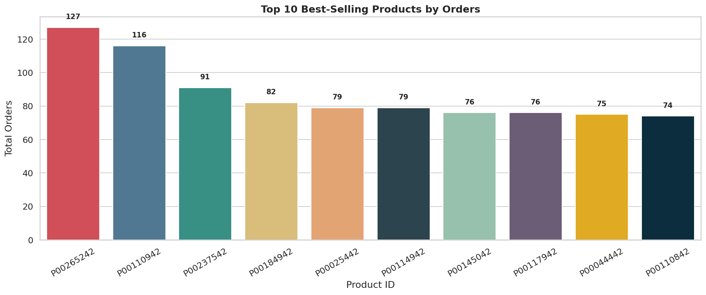
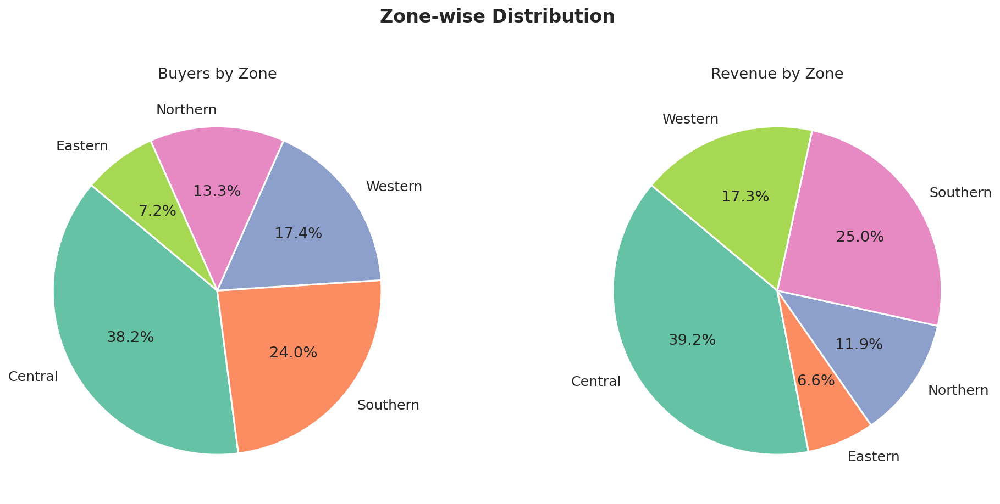

# 🪔 Diwali Sales Analysis


> Exploratory Data Analysis of customer purchase behavior during the Diwali festival season — uncovering who buys what, from where, and why.

---

## 📌 Table of Contents
- [Project Overview](#-project-overview)
- [Dataset](#-dataset)
- [Key Insights](#-key-insights)
- [Visualizations](#-visualizations)
- [Project Structure](#-project-structure)
- [Getting Started](#-getting-started)
- [Analysis Walkthrough](#-analysis-walkthrough)
- [Technologies Used](#-technologies-used)
- [License](#-license)

---

## 🎯 Project Overview

This project performs **end-to-end Exploratory Data Analysis (EDA)** on a Diwali retail sales dataset. The goal is to help a retail business understand its customers better and identify opportunities to improve sales targeting during the festive season.

The analysis covers:
- Data cleaning & preprocessing
- Demographic analysis (gender, age, marital status)
- Geographic analysis (state-wise orders & revenue)
- Occupational and zone-based analysis
- Product category & product-level performance

---

## 📦 Dataset

| Property | Details |
|---|---|
| **File** | `data/Diwali_Sales_Data.csv` |
| **Records** | ~11,000 transactions |
| **Columns** | 13 features (after cleaning) |

### Column Reference

| Column | Description |
|---|---|
| `User_ID` | Unique customer identifier |
| `Cust_name` | Customer name |
| `Product_ID` | Unique product identifier |
| `Gender` | M / F |
| `Age Group` | Age bracket (e.g., 26-35) |
| `Age` | Customer age |
| `Marital_Status` | 0 = Single, 1 = Married |
| `State` | Indian state of purchase |
| `Zone` | Geographic zone |
| `Occupation` | Customer's profession |
| `Product_Category` | Category of purchased product |
| `Orders` | Number of orders placed |
| `Amount` | Total purchase amount (₹) |

---

## 💡 Key Insights

1. **👩 Female buyers dominate** — Female customers outnumber male customers and also have a significantly higher total purchase value.
2. **🎂 Prime buyer segment: 26–35 years** — This age group, especially females, contributes the highest purchase volume and revenue.
3. **📍 Top states: UP, Maharashtra, Karnataka** — These three states lead in both order count and total sales amount.
4. **💍 Married women spend more** — Married female customers show the highest purchasing power across all demographic segments.
5. **💼 Top occupations: IT, Healthcare, Aviation** — Customers from these sectors are the most active buyers during Diwali.
6. **🛒 Best-selling categories: Food, Clothing, Electronics** — These three categories account for the highest sales volume and revenue.

---

## 📊 Visualizations

### Gender Analysis


### Age Group Analysis


### State-wise Analysis


### Marital Status Analysis


### Occupation Analysis


### Product Category Analysis


### Top 10 Best-Selling Products


### Zone Distribution


---

## 📁 Project Structure

```
diwali-sales-analysis/
│
├── data/
│   └── Diwali_Sales_Data.csv
│
├── assets/
│   ├── 01_gender_analysis.png
│   ├── 02_age_group_analysis.png
│   ├── 03_state_analysis.png
│   ├── 04_marital_status_analysis.png
│   ├── 05_occupation_analysis.png
│   ├── 06_product_category_analysis.png
│   ├── 07_top_products.png
│   └── 08_zone_distribution.png
│
├── Diwali_Sales_Analysis.ipynb
├── requirements.txt
├── .gitignore
├── LICENSE
└── README.md
```

---

## 🚀 Getting Started

### 1. Clone the Repository
```bash
git clone https://github.com/your-username/diwali-sales-analysis.git
cd diwali-sales-analysis
```

### 2. Install Dependencies
```bash
pip install -r requirements.txt
```

### 3. Launch Jupyter Notebook
```bash
jupyter notebook Diwali_Sales_Analysis.ipynb
```

---

## 🔍 Analysis Walkthrough

| Section | Description |
|---|---|
| **Data Loading** | Load CSV, preview shape and dtypes |
| **Data Cleaning** | Drop null columns, handle missing values, fix types |
| **Gender Analysis** | Count & revenue comparison by gender |
| **Age Group Analysis** | Segment buyers and revenue by age group |
| **State Analysis** | Top 10 states by orders and revenue |
| **Marital Status** | Buyer count and revenue by marital status × gender |
| **Occupation** | Count and revenue across all occupations |
| **Product Category** | Order count and top-10 revenue categories |
| **Top Products** | Best-selling individual products |
| **Zone Distribution** | Buyer share and revenue share by zone |

### 🏁 Final Conclusion

> **Married women aged 26–35 from Uttar Pradesh, Maharashtra, and Karnataka, working in IT, Healthcare, and Aviation, are the most likely customers to purchase Food, Clothing, and Electronics during the Diwali festival season.**

### Business Recommendations

| Area | Recommendation |
|---|---|
| **Targeting** | Focus ad campaigns on married women aged 26–35 |
| **Geography** | Prioritize inventory & delivery in UP, Maharashtra, Karnataka |
| **Channels** | Leverage professional networks to reach IT & Healthcare workers |
| **Categories** | Ensure strong stock and offers on Food, Clothing, and Electronics |
| **Timing** | Run promotions 2–3 weeks before Diwali to capture peak demand |

---

## 🛠 Technologies Used

| Tool | Purpose |
|---|---|
| **Python 3** | Core programming language |
| **Pandas** | Data loading, cleaning, transformation |
| **NumPy** | Numerical operations |
| **Matplotlib** | Base plotting |
| **Seaborn** | Statistical visualizations |
| **Jupyter Notebook** | Interactive analysis environment |

---

## 📄 License

This project is licensed under the [MIT License](LICENSE).

---

## 🙋 Author

Made with ❤️ for learning and portfolio demonstration.  
Feel free to fork, star ⭐, or raise an issue!
